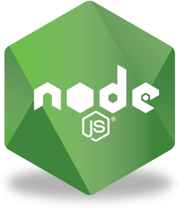

  

**"code never lies, comments sometimes do"**

# Hey there 
# I'm - Ich bin - Yo soy - [Nico!](https://www.linkedin.com/in/nicolas-arthur-keller/)
 

  

 

# About me

🎓 Currently in my 5th semester of Computer Science at the <a href="https://www.unisg.ch/en/">University of St. Gallen</a>

🚧 I'm currently focused on improving my software skills and problem solving

👨‍💻 Interested in Artificial Intelligence, Software Engineering, Startups

🪂 Among my hobbies are cooking, drinking wine, playing tennis and padel, reading self-improvement books, traveling and music

# 🧰 My Skills

<code></code>
<code></code>
<code></code>
<code></code>
<code></code>
<code></code>

 

<code></code>
<code></code>
<code></code>
<code></code>
<code></code>

 

<code></code>
<code></code>
<code></code>
<code></code>
<code></code>
<code></code>
<code></code>
<code></code>
<code></code>

 
 

 

 

